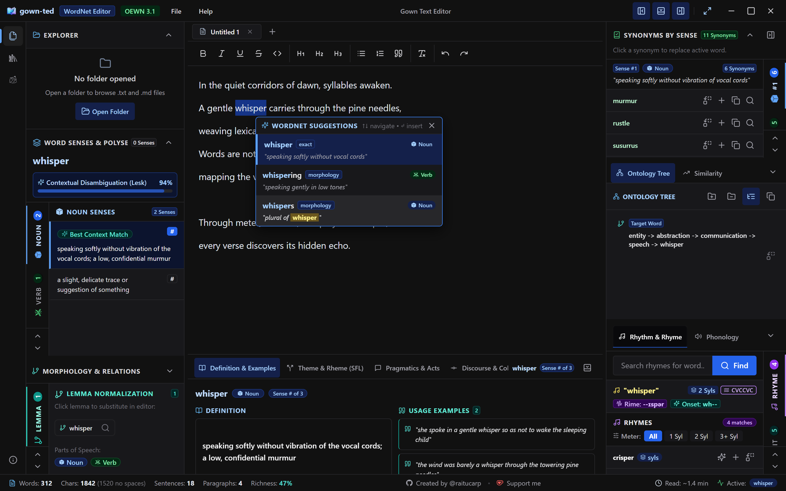
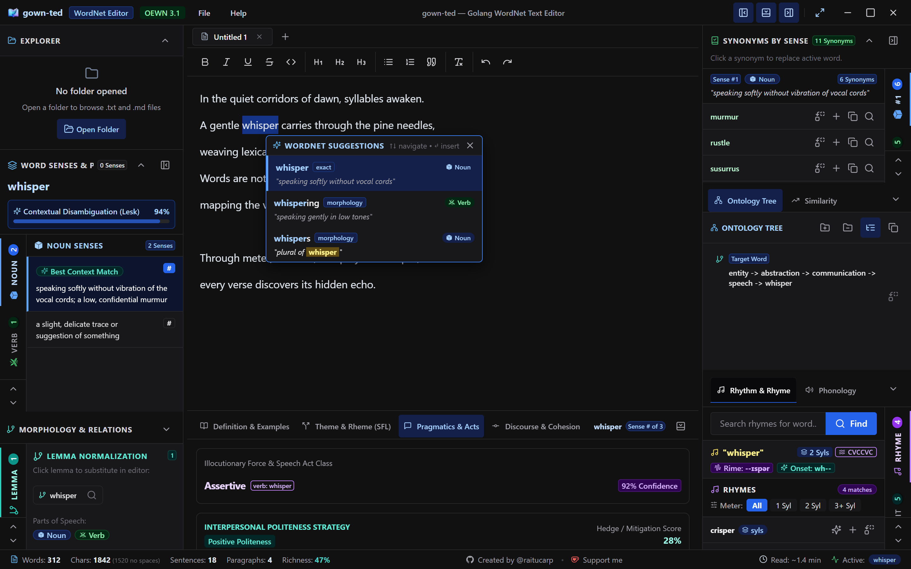

<div align="center">
  
  <h1>gown-ted</h1>
  <p><strong>The Intelligent Desktop Text Editor Infused with Princeton WordNet & Computational Poetics</strong></p>

  <p>
    <a href="https://github.com/raitucarp/gown-ted/releases/latest"></a>
    <a href="https://github.com/raitucarp/gown-ted/blob/main/LICENSE"></a>
    
    
  </p>

  <p>
    <a href="https://raitucarp.github.io/gown-ted/"><strong>Explore Documentation Website ↗</strong></a> &nbsp;|&nbsp;
    <a href="https://github.com/raitucarp/gown-ted/releases/latest"><strong>Download Latest Release</strong></a> &nbsp;|&nbsp;
    <a href="https://ko-fi.com/raitucarp"><strong>Support on Ko-fi ❤️</strong></a>
  </p>
</div>

<br />

<div align="center">
  
</div>

<br />

## Why gown-ted?

Word choice is the soul of writing. Yet typical thesauruses dump flat, context-free lists of synonyms, often leading to awkward phrasing and lost subtleties. 

**gown-ted** is built from the ground up for **writers, poets, essayists, researchers, and linguists**. It places the full taxonomic depth of **Princeton WordNet 3.1** and **Open English Wordnet** right beside your cursor:

- **Sense-Aware Synonyms:** Never choose the wrong synonym again. gown-ted automatically disambiguates your sentence context using the Lesk WSD algorithm to highlight the precise meaning you intended.
- **Musicality & Meter:** Rhyme dictionaries, alliterative onsets, syllable counters, and Consonant-Vowel (CV) cadence analysis help poets and lyricists sculpt rhythm with surgical precision.
- **Deep Discourse & Grammar:** Explore Theme/Rheme information structure, politeness hedging, and speech acts in a sleek, non-intrusive workspace.
- **100% Private & Offline:** Your writing never leaves your computer. No AI cloud subscriptions, no tracking, and zero latency.

---

## ✨ Highlights & Key Features

### 🧠 Contextual Sense Disambiguation & Ontology
- **Smart Lesk WSD:** When you select or type a word, gown-ted reads the surrounding sentence and highlights the most likely synset with a confidence score.
- **Synonyms by Sense:** Synonyms are grouped strictly by definition and Part of Speech (*Noun*, *Verb*, *Adjective*, *Adverb*), complete with one-click word replacement or insertion.
- **Taxonomic Tree:** Traverse semantic hierarchies from specific terms (*whisper*) up to broad concepts (*speech* &rarr; *communication* &rarr; *abstraction*).
- **Wu-Palmer Similarity:** Calculate conceptual affinity and shared ancestors between any two concepts.

<br />

<div align="center">
  
</div>

<br />

### 🎵 Poetics, Rhyme & Rhythm Studio
- **Accurate Syllable Counting:** Real-time syllable metrics for every selected word.
- **Rhyme Discovery:** Filter perfect and near rhymes by meter (`All`, `1 Syl`, `2 Syl`, `3+ Syl`).
- **Alliteration & Onsets:** Discover words sharing identical consonant onsets to weave musicality into verse.
- **CV Rhythmic Patterns:** Match rhythmic cadences (e.g. `CVCCVC`) across lines for subtle internal harmony.

### 📊 Real-Time Document Analytics
- **Live Status Bar:** Words, characters, sentences, paragraphs, reading time, and speaking time calculated as you write.
- **Lexical Diversity:** Measures vocabulary richness (**Type-Token Ratio / TTR**) to identify repetitive diction.

### 🎨 Distraction-Free Dark Workspace
- **Chakra UI v3 Theming:** Deep slate palette, customizable font sizes, and smooth resizing panels.
- **Focus Mode (`Ctrl + Shift + F`):** Collapse all sidebars and toolbars with one keystroke for pure, uninterrupted writing.
- **Local File Explorer:** Open, edit, and organize `.txt` and `.md` documents in your working folders.

---

## 🚀 Quick Start & Installation

### Windows (Precompiled Standalone)
1. Download the latest `gown-ted-windows-amd64.zip` from [GitHub Releases](https://github.com/raitucarp/gown-ted/releases/latest).
2. Extract the `.zip` archive to your preferred directory.
3. Launch `gown-ted.exe` and begin writing!

### macOS & Linux
Precompiled binaries for macOS and Linux are coming with our automated GitHub Actions release workflow. In the meantime, you can easily build from source:

```bash
# 1. Clone repository
git clone https://github.com/raitucarp/gown-ted.git
cd gown-ted

# 2. Build UI assets
cd ui && npm install && npm run build && cd ..

# 3. Run or build with Wails v3
wails3 dev      # Run in development mode
wails3 build    # Compile standalone binary
```

---

## ⌨️ Essential Keyboard Shortcuts

| Shortcut (Win / Linux) | Shortcut (macOS) | Action |
|---|---|---|
| `Ctrl + N` | `Cmd + N` | Open New Document Tab |
| `Ctrl + O` | `Cmd + O` | Open File from Disk |
| `Ctrl + S` | `Cmd + S` | Save Current Document |
| `Ctrl + W` | `Cmd + W` | Close Active Tab |
| `Ctrl + Shift + F` | `Cmd + Shift + F` | **Toggle Focus Mode** (Hide/Show Panels) |
| `Ctrl + B` / `Ctrl + I` | `Cmd + B` / `Cmd + I` | Bold / Italic Formatting |
| `Ctrl + Z` / `Ctrl + Y` | `Cmd + Z` / `Cmd + Shift + Z` | Undo / Redo |
| `↑` / `↓` / `Enter` | `↑` / `↓` / `Enter` | Navigate & Accept Autocomplete Suggestions |
| `Escape` | `Escape` | Dismiss WordNet Suggestion Popup |

---

## 📖 Comprehensive Documentation

Looking for deep dives into WordNet ontology, phonological models, or systemic functional grammar?

👉 **Read the full online documentation at: [https://raitucarp.github.io/gown-ted/](https://raitucarp.github.io/gown-ted/)**

- [Getting Started Guide](https://raitucarp.github.io/gown-ted/docs/getting-started/)
- [Core Features & Lexical Suite](https://raitucarp.github.io/gown-ted/docs/features/)
- [Poetics, Rhyme & Meter Guide](https://raitucarp.github.io/gown-ted/docs/poetics-and-rhyme/)
- [Complete Keyboard Reference](https://raitucarp.github.io/gown-ted/docs/keyboard-shortcuts/)

---

## 🤝 Contributing & Community

gown-ted is free, open-source software built for the writing and research community.

- **Found a bug or have an idea?** Open an issue on [GitHub Issues](https://github.com/raitucarp/gown-ted/issues).
- **Want to contribute?** Pull requests are warmly welcomed!
- **Love gown-ted?** Star this repository or support development on [Ko-fi](https://ko-fi.com/raitucarp).

---

## 📄 License

Distributed under the **MIT License**. See [`LICENSE`](LICENSE) for more information.

*Built with ❤️ by [Ribhararnus Pracutiar (@raitucarp)](https://github.com/raitucarp)*
